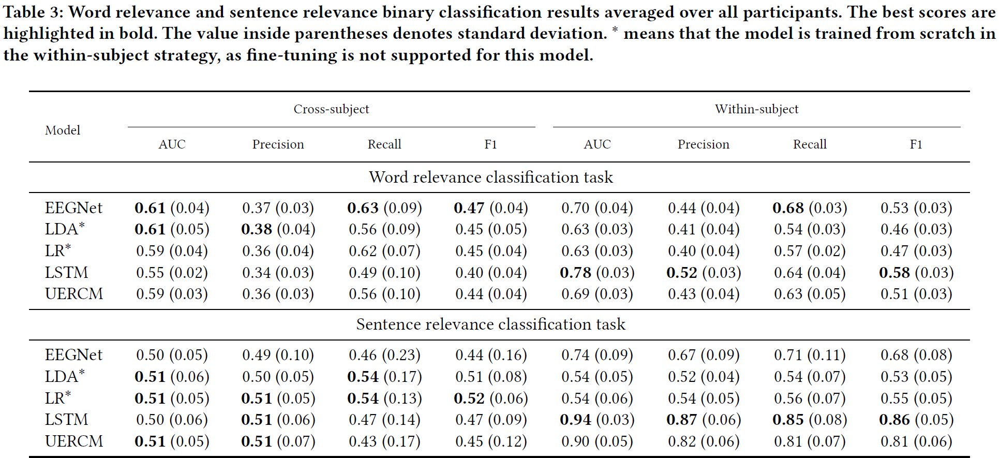

# An EEG dataset of word-level brain responses for semantic text relevance

The raw EEG data and the datasheet will be avaialble on January 25, 2025 AOE.
Pre-processed dataset is available from [huggingface][1].

**Short description**: Electroencephalography (EEG) enables non-invasive, real-time tracking of brain activity during language processing. Existing EEG datasets focus either on natural reading or controlled psycholinguistic settings. To address this gap, we introduce a novel dataset of 23,270 time-locked (0.7s) word-level EEG recordings, where participants read text that was either semantically relevant or irrelevant to self-selected topics. We benchmark two evaluation protocols — participant-independent and participant-dependent — on word and sentence relevance prediction tasks, using five models. Our dataset and code are openly available, supporting advancements in language relevance research, psycholinguistics, and brain-computer interface (BCI) systems for real-time semantic detection.

---
# Reproducibility of the benchmark results

## Configure the environment
``poetry`` is used for dependency management.
See how to install ``poetry`` here: [poetry][2].

After ``poetry`` is installed, run ``poetry install`` in the folder where the ``README.md`` file is located.


## Getting the preprocessed and prepared data

Download the ``data_prepared_for_benchmark`` from [data repository][3] and extract the files.

## Run word relevance classification task

The ``project_path`` should point to the folder that contains the data needed to reproduce the benchmark results.
```py
poetry run python benchmark.py --project_path=path --benchmark=w
```

## Run sentence relevance classification task

The ``project_path`` should point to the folder that contains the data needed to reproduce the benchmark results.
```py
poetry run python benchmark.py --project_path=path --benchmark=s
```

## Generate prediction scores
Scores are saved to a ``logs_results.log`` file and outputted in a terminal window

```py
poetry run python generate_results.py --project_path=path
```

## Benchmark results:



  [1]: https://huggingface.co/datasets/Quoron/EEG-semantic-text-relevance
  [2]: https://python-poetry.org/docs/#installation
  [3]: https://drive.proton.me/urls/2TWQXJW2C4#9G2lbi7SuGFE
